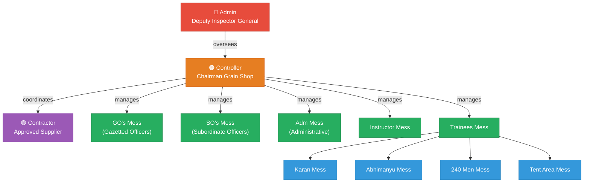
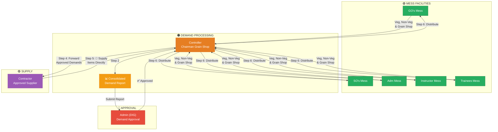

# 🏢 ITBP RTC — Grain Shop Organizational Hierarchy & Demand Flow

> **Document Version:** 3.0  
> **Last Updated:** 2026-02-21  
> **Project:** Marutam — Grain Shop Management System

---

## 📋 Table of Contents

- [Overview](#overview)
- [Role Hierarchy](#role-hierarchy)
- [Mess Structure](#mess-structure)
- [Item Inventory Management](#item-inventory-management)
- [Access Control Matrix](#access-control-matrix)
- [Admin Reports](#admin-reports)
- [Audit Trail & Logging](#audit-trail--logging)
- [Organizational Flow Diagram](#organizational-flow-diagram)
- [Demand & Supply Flow](#demand--supply-flow)
- [Daily Mess Entry](#daily-mess-entry)
- [Approval Workflow](#approval-workflow)
- [Detailed Breakdown](#detailed-breakdown)

---

## Overview

This document outlines the organizational hierarchy, mess structure, and **demand-to-supply workflow** for the **ITBP Regional Training Centre (RTC)** Grain Shop Management System. The system is governed by a top-down administrative structure with a clear approval pipeline — from mess demand submission through administrative approval to contractor fulfillment.

---

## Role Hierarchy

| Level | Role | Designation | Responsibility |
|-------|------|-------------|----------------|
| **1** | 🔴 Admin | Deputy Inspector General (DIG) | Final approval authority, full CRUD on all users & contractor management |
| **2** | 🟠 Controller | Chairman, Grain Shop | Receives demands, submits reports, coordinates supply |
| **3** | 🟣 Contractor | Approved Supplier (User role, yearly tender) | Fulfills demands after Admin approval |
| **4** | 🟢 Mess Facilities | Mess In-Charges | Submits Veg, Non-Veg & Grain Shop item demands |

- The **Admin (DIG)** holds the highest authority — approves or rejects consolidated demands. Has **full CRUD access to all users** including contractor management.
- The **Controller (Chairman Grain Shop)** collects demands from all messes, prepares reports, and submits them to Admin for approval.
- The **Contractor** receives approved demands from the Controller and supplies the required Veg, Non-Veg & Grain Shop items. The Contractor is also a **user in the system** and may change based on **yearly tender**.
- The **Mess Facilities** raise Veg, Non-Veg & Grain Shop item demands based on their daily/weekly requirements.

### User Management (Admin Only)

| Operation | Description | Who Can Perform |
|-----------|-------------|------------------|
| **Create** | Add new users (Controller, Mess In-Charge, Contractor) | 🔴 Admin only |
| **Read** | View all user details and profiles | 🔴 Admin only |
| **Update** | Edit user roles, permissions, and details | 🔴 Admin only |
| **Delete** | Remove / deactivate users | 🔴 Admin only |

> 📌 **Contractor as a User:** The Contractor is treated as a user within the system. Since contractors are selected through a **yearly tender process**, the Admin can create a new contractor user and deactivate the previous one when the tender changes.

---

## Item Inventory Management

The **item inventory** (Veg, Non-Veg & Grain Shop items) is managed by the **Controller**, with Admin oversight on pricing and unit changes.

### Inventory Responsibilities

| Action | Managed By | Requires Admin Approval? |
|--------|-----------|-------------------------|
| Add new items to inventory | 🟠 Controller | ❌ No |
| Update item stock / quantity | 🟠 Controller | ❌ No |
| **Change item price** | 🟠 Controller (proposes) | ✅ **Yes — Admin approval required** |
| **Change item unit** (e.g., kg → litre) | 🟠 Controller (proposes) | ✅ **Yes — Admin approval required** |
| View item price details | 🔴 Admin, 🟠 Controller | N/A |
| View items (without price) | 🟢 Mess Members | N/A |
| Delete / deactivate items | 🟠 Controller | ❌ No |

### Price & Unit Change Workflow

```
  🟠 Controller              🔴 Admin
  ──────────────              ────────
     │                         │
     │  Propose Price/Unit     │
     │  Change                 │
     │ ─────────────────────► │
     │                         │
     │                         │  Review &
     │                         │  Validate
     │                         │
     │  Approved ✅ / Rejected ❌│
     │ ◄───────────────────── │
     │                         │
     │  (If approved)          │
     │  Price/Unit updated     │
     │  in system              │
     │                         │
```

> ⚠️ **Important:** Prices and units **cannot be changed** without Admin validation. Once the Admin approves, the updated price/unit is visible to the Controller and Admin only — **not to Mess Members**.

---

## Access Control Matrix

This section defines **what each role can see and do** across the system.

### Item Access

| Feature | 🔴 Admin | 🟠 Controller | 🟣 Contractor | 🟢 Mess Members |
|---------|---------|-------------|-------------|----------------|
| View items list | ✅ Yes | ✅ Yes | ✅ Yes | ✅ Yes |
| View item **price** | ✅ Yes | ✅ Yes | ❌ No | ❌ **No** |
| View item **unit** | ✅ Yes | ✅ Yes | ✅ Yes | ✅ Yes |
| Add / edit items | ❌ No | ✅ Yes | ❌ No | ❌ No |
| Change item price | ✅ Approve | ✅ Propose | ❌ No | ❌ No |
| Change item unit | ✅ Approve | ✅ Propose | ❌ No | ❌ No |

### Demand & Supply Access

| Feature | 🔴 Admin | 🟠 Controller | 🟣 Contractor | 🟢 Mess Members |
|---------|---------|-------------|-------------|----------------|
| Submit demand | ❌ No | ❌ No | ❌ No | ✅ **Yes** |
| View all demands | ✅ Yes | ✅ Yes | ✅ (approved only) | ✅ (own mess only) |
| Consolidate demands | ❌ No | ✅ Yes | ❌ No | ❌ No |
| Approve/Reject demands | ✅ **Yes** | ❌ No | ❌ No | ❌ No |
| Receive approved demand list | ❌ No | ✅ Yes | ✅ Yes | ❌ No |
| Supply items | ❌ No | ❌ No | ✅ **Yes** | ❌ No |
| Distribute to messes | ❌ No | ✅ **Yes** | ❌ No | ❌ No |
| Add daily entry (items received) | ❌ No | ❌ No | ❌ No | ✅ **Yes** |

### User & System Management

| Feature | 🔴 Admin | 🟠 Controller | 🟣 Contractor | 🟢 Mess Members |
|---------|---------|-------------|-------------|----------------|
| Manage users (CRUD) | ✅ **Yes** | ❌ No | ❌ No | ❌ No |
| Manage contractors | ✅ **Yes** | ❌ No | ❌ No | ❌ No |
| View **all reports** | ✅ **Yes (Full Access)** | ✅ Limited | ❌ No | ❌ No |
| Manage inventory | ❌ No | ✅ **Yes** | ❌ No | ❌ No |

---

## Admin Reports

The Admin has **complete visibility into every aspect** of the system through comprehensive reports. This ensures full oversight of demand, supply, inventory, users, and financial data.

### Report Categories

#### 1. 📊 Demand Reports

| Report | Description |
|--------|-------------|
| **All Demands** | View all demands submitted by all mess facilities |
| **Demands by Mess** | Filter demands by specific mess (GO's, SO's, Adm, Instructor, Trainees) |
| **Demands by Category** | Filter by Veg / Non-Veg / Grain Shop |
| **Demands by Status** | Draft, Submitted, Approved, Rejected |
| **Demands by Date Range** | View demands within a specific period |
| **Pending Approvals** | Demands waiting for Admin review |

#### 2. 🚚 Supply Reports

| Report | Description |
|--------|-------------|
| **Contractor Supply History** | All items supplied by the Contractor over time |
| **Supply vs Demand** | Compare what was demanded vs what was actually supplied |
| **Supply by Date Range** | Filter supply records within a specific period |
| **Pending Supplies** | Approved demands not yet supplied by Contractor |

#### 3. 📦 Inventory Reports

| Report | Description |
|--------|-------------|
| **Current Inventory** | Real-time stock levels across all items |
| **Item List with Prices** | Complete item catalog with current prices |
| **Price Change History** | Audit trail of all price/unit changes (who proposed, when approved) |
| **Low Stock Alerts** | Items below minimum threshold |
| **Item Category Breakdown** | Inventory grouped by Veg / Non-Veg / Grain Shop |

#### 4. 👥 User Reports

| Report | Description |
|--------|-------------|
| **All Users** | Complete list of all users in the system |
| **Users by Role** | Filter by Admin, Controller, Contractor, Mess Member |
| **User Activity Log** | Track user actions (logins, submissions, approvals) |
| **Active / Inactive Users** | View current and deactivated users |

#### 5. 📝 Contractor Reports

| Report | Description |
|--------|-------------|
| **Current Contractor** | Details of the active contractor |
| **Contractor History** | Past contractors with their tenure (yearly tender) |
| **Contractor Performance** | Supply timeliness, item quality, delivery records |
| **Contractor Invoices** | All invoices submitted by the contractor |

#### 6. 🏠 Daily Mess Entry Reports

| Report | Description |
|--------|-------------|
| **Daily Entries by Mess** | View item receipt logs per mess facility |
| **Daily Entries by Date** | Filter entries within a specific date range |
| **Distributed vs Received** | Compare what Controller distributed vs what mess logged |
| **Missing Entries** | Messes that haven't logged their daily entry |

#### 7. 💰 Financial Reports

| Report | Description |
|--------|-------------|
| **Total Expenditure** | Overall spending by category and time period |
| **Cost per Mess** | Expenditure breakdown per mess facility |
| **Category-wise Spending** | Spending on Veg vs Non-Veg vs Grain Shop items |
| **Monthly / Quarterly Summary** | Consolidated financial overview |

### Report Access Summary

```
┌────────────────────────────────────────────────────────────┐
│                 REPORT ACCESS BY ROLE                    │
└────────────────────────────────────────────────────────────┘

  🔴 Admin          ──►  ALL REPORTS (Full Access)
                        • Demand Reports
                        • Supply Reports
                        • Inventory Reports
                        • User Reports
                        • Contractor Reports
                        • Daily Mess Entry Reports
                        • Financial Reports

  🟠 Controller      ──►  LIMITED REPORTS
                        • Demand Reports (submitted by messes)
                        • Inventory Reports (stock levels)

  🟣 Contractor      ──►  NO REPORTS

  🟢 Mess Members    ──►  NO REPORTS
                        (can only view own demands & daily entries)
```

> 📊 **Admin has full visibility** into every report across the system — demand, supply, inventory, users, contractors, daily mess entries, and financial data. No data is hidden from the Admin.

---

## Audit Trail & Logging

The Admin has access to a **complete audit trail** and **detailed logging** of every action performed across the entire system. This ensures full accountability, transparency, and traceability.

### What Gets Logged

| Area | Logged Events |
|------|---------------|
| **User Management** | User created, updated, deactivated, role changed, login/logout |
| **Item Inventory** | Item added, edited, deactivated, price change proposed, unit change proposed |
| **Price/Unit Approvals** | Change proposed (by whom, when), approved/rejected (by Admin, when), old value → new value |
| **Demands** | Demand created, submitted, approved, rejected (by whom, when, quantities) |
| **Contractor** | Contractor added, updated, deactivated, tender changed |
| **Supply** | Items supplied by Contractor (what, when, quantities), received by Controller |
| **Distribution** | Items distributed to messes (what, when, to which mess, quantities) |
| **Daily Mess Entries** | Entry logged (by whom, which mess, what items, quantities, date) |
| **System Access** | Login attempts, session activity, role-based access events |

### Log Entry Format

Every log entry captures:

| Field | Description |
|-------|-------------|
| **Timestamp** | Exact date and time of the action |
| **Actor** | Who performed the action (user name & role) |
| **Action** | What was done (created, updated, approved, rejected, etc.) |
| **Target** | What was affected (item, demand, user, etc.) |
| **Before Value** | Previous state (for changes) |
| **After Value** | New state (for changes) |
| **IP / Session** | System access details |

### Audit Trail Flow

```
  Every Action in the System
  ───────────────────────
          │
          ▼
  ┌──────────────────────────────┐
  │     📝 AUDIT LOG              │
  │                              │
  │  • Who did it?               │
  │  • What was done?            │
  │  • When?                     │
  │  • What changed?             │
  │    (before → after)          │
  └──────────────┬───────────────┘
                 │
                 ▼
  ┌──────────────────────────────┐
  │   🔴 ADMIN DASHBOARD          │
  │                              │
  │  Full access to all logs     │
  │  • Filter by user            │
  │  • Filter by action type     │
  │  • Filter by date range      │
  │  • Filter by module          │
  │  • Export logs               │
  └──────────────────────────────┘
```

> 🔍 **Full Traceability:** The Admin can track **any change at any level** — from a price modification to a demand approval to a daily mess entry. Every action is timestamped, attributed to a user, and stored with before/after values for complete audit compliance.

## Mess Structure

The Chairman oversees **five (5) distinct mess facilities**, one of which further branches into sub-units.

### Primary Mess Facilities

| # | Mess Name | Serves | Sub-Units |
|---|-----------|--------|-----------|
| 1 | **GO's Mess** | Gazetted Officers | — |
| 2 | **SO's Mess** | Subordinate Officers | — |
| 3 | **Adm Mess** | Administrative Staff | — |
| 4 | **Instructor Mess** | Instructors | — |
| 5 | **Trainees Mess** | Trainees | 4 sub-units |

### Trainees Mess — Sub-Units

| # | Sub-Unit Name |
|---|---------------|
| 1 | **Karan Mess** |
| 2 | **Abhimanyu Mess** |
| 3 | **240 Men Mess** |
| 4 | **Tent Area Mess** |

---

## Organizational Flow Diagram

```
                    ┌──────────────────────────────┐
                    │     🔴 ADMIN                 │
                    │  Deputy Inspector General    │
                    │          (DIG)               │
                    └──────────────┬───────────────┘
                                   │
                                   │ oversees
                                   ▼
                    ┌──────────────────────────────┐
                    │   🟠 CONTROLLER              │
                    │  Chairman, Grain Shop        │
                    └──────────────┬───────────────┘
                                   │
                    ┌──────────────┴───────────────┐
                    │                              │
                    │ manages                      │ coordinates
                    ▼                              ▼
  ┌──────────────────────────┐    ┌──────────────────────────────┐
  │     MESS FACILITIES      │    │      🟣 CONTRACTOR           │
  │  (Demand Originators)    │    │    (Approved Supplier)       │
  └────────────┬─────────────┘    └──────────────────────────────┘
               │
    ┌──────────┼───────────┬───────────┬───────────────┐
    │          │           │           │               │
    ▼          ▼           ▼           ▼               ▼
┌────────┐ ┌────────┐ ┌────────┐ ┌──────────┐ ┌──────────────┐
│  GO's  │ │  SO's  │ │  Adm   │ │Instructor│ │   Trainees   │
│  Mess  │ │  Mess  │ │  Mess  │ │   Mess   │ │     Mess     │
└────────┘ └────────┘ └────────┘ └──────────┘ └──────┬───────┘
                                                      │
                                   ┌──────────┬───────┴──────┬───────────┐
                                   │          │              │           │
                                   ▼          ▼              ▼           ▼
                              ┌────────┐ ┌─────────┐ ┌─────────┐ ┌──────────┐
                              │ Karan  │ │Abhimanyu│ │ 240 Men │ │Tent Area │
                              │  Mess  │ │  Mess   │ │  Mess   │ │   Mess   │
                              └────────┘ └─────────┘ └─────────┘ └──────────┘
```

---

## Daily Mess Entry

Mess members are required to **log daily entries** of items received at their mess facility. This ensures accurate tracking of supply distribution.

### How It Works

| Step | Action | Actor |
|------|--------|-------|
| **1** | Controller distributes items to mess facilities | 🟠 Controller |
| **2** | Mess member receives items at their mess | 🟢 Mess Member |
| **3** | Mess member logs a **daily entry** with item-wise received counts | 🟢 Mess Member |

### Daily Entry Details

Each daily entry by a mess member includes:

| Field | Description |
|-------|-------------|
| **Date** | Date of receipt |
| **Mess Name** | The mess facility receiving the items |
| **Item Name** | Name of the item received |
| **Category** | Veg / Non-Veg / Grain Shop |
| **Quantity Received** | Count or weight of items received |
| **Entered By** | Mess member who logged the entry |

### Daily Entry Flow

```
  🟠 Controller              🟢 Mess Member
  ──────────────              ──────────────
     │                         │
     │  Distribute Items       │
     │ ─────────────────────► │
     │                         │
     │                         │  Receive Items
     │                         │
     │                         │  Log Daily Entry:
     │                         │  • Item Name
     │                         │  • Category
     │                         │  • Quantity Received
     │                         │  • Date
     │                         │
     │                         │  ✅ Entry Saved
     │                         │
```

> 📝 **Mess members can ONLY:**
> 1. **View items** (without price details)
> 2. **Submit demands** for Veg, Non-Veg & Grain Shop items
> 3. **Add daily entries** of items received at their mess (based on counts)

---

## Demand & Supply Flow

This section describes how **Veg, Non-Veg, and Grain Shop item demands** flow through the system — from mess facilities through administrative approval to final supply.

### Flow Summary

```
Step 1 ──► Step 2 ──► Step 3 ──► Step 4 ──► Step 5 ──► Step 6
DEMAND      COLLECT    REPORT     APPROVE    SUPPLY     DISTRIBUTE
                                 (Admin)    TO CTRL    TO MESSES
```

| Step | Action | From | To | Details |
|------|--------|------|----|---------|
| **1** | 📝 Submit Demand | Mess Facilities | Controller | Each mess submits Veg, Non-Veg & Grain Shop item demands |
| **2** | 📊 Consolidate & Report | Controller | Admin | Controller consolidates all demands into a report |
| **3** | ✅ Approve / ❌ Reject | Admin | Controller | Admin reviews the demand report and approves/rejects |
| **4** | 📦 Forward to Contractor | Controller | Contractor | Approved demands are sent to the Contractor |
| **5** | 🚚 Supply Items to Controller | Contractor | Controller | Contractor directly delivers Veg, Non-Veg & Grain Shop items **to the Controller** |
| **6** | 📤 Distribute to Messes | Controller | Mess Facilities | Controller distributes received items to respective messes |

> ⚠️ **Admin Approval** is required only at **Step 3** (demand approval). The Contractor directly supplies items to the Controller without additional approval.

### Demand Types

| Category | Examples |
|----------|----------|
| 🥬 **Veg Items** | Vegetables, Fruits, Pulses, Spices, Oil, etc. |
| 🍗 **Non-Veg Items** | Chicken, Mutton, Fish, Eggs, etc. |
| 🌾 **Grain Shop Items** | Rice, Wheat, Flour (Atta), Dal, Sugar, Tea, Salt, etc. |

---

### Demand & Supply Flow Diagram (ASCII)

```
┌─────────────────────────────────────────────────────────────────────────────────┐
│                       DEMAND & SUPPLY WORKFLOW (6 Steps)                       │
└─────────────────────────────────────────────────────────────────────────────────┘

  ┌──────────┐   ┌──────────┐   ┌──────────┐   ┌──────────┐   ┌──────────────┐
  │  GO's    │   │  SO's    │   │   Adm    │   │Instructor│   │   Trainees   │
  │  Mess    │   │  Mess    │   │   Mess   │   │   Mess   │   │     Mess     │
  └────┬─────┘   └────┬─────┘   └────┬─────┘   └────┬─────┘   └──────┬───────┘
       │              │              │              │                │
       │  Veg, Non-Veg │  Veg, Non-Veg │  Veg, Non-Veg │  Veg, Non-Veg   │  Veg, Non-Veg
       │  & Grain Shop │  & Grain Shop │  & Grain Shop │  & Grain Shop   │  & Grain Shop
       │  Demand      │  Demand      │  Demand      │  Demand        │  Demand
       │              │              │              │                │
       └──────────────┴──────────────┴──────┬───────┴────────────────┘
                                            │
                                            ▼  STEP 1: Submit Demands
                              ┌──────────────────────────────┐
                              │      🟠 CONTROLLER           │
                              │   Chairman, Grain Shop       │
                              │                              │
                              │  • Collects all demands      │
                              │  • Consolidates into report  │
                              │  • Categorizes Veg/Non-Veg   │
                              └──────────────┬───────────────┘
                                             │
                                             │  STEP 2: Submit Demand Report
                                             ▼
                              ┌──────────────────────────────┐
                              │        🔴 ADMIN              │
                              │  Deputy Inspector General    │
                              │                              │
                              │  • Reviews demand report     │
                              │  • Verifies quantities       │
                              │  • Approves ✅ or Rejects ❌  │
                              └──────────────┬───────────────┘
                                             │
                                             │  STEP 3: Demand Approval
                                             ▼
                              ┌──────────────────────────────┐
                              │      🟠 CONTROLLER           │
                              │   Chairman, Grain Shop       │
                              │                              │
                              │  • Receives approval status  │
                              │  • Forwards approved demands │
                              └──────────────┬───────────────┘
                                             │
                                             │  STEP 4: Forward Approved Demands
                                             ▼
                              ┌──────────────────────────────┐
                              │      🟣 CONTRACTOR           │
                              │    (Approved Supplier)       │
                              │                              │
                              │  • Receives approved list    │
                              │  • Procures Veg, Non-Veg  │
                              │    & Grain Shop items    │
                              └──────────────┬───────────────┘
                                             │
                                             │  STEP 5: Supply Items Directly
                                             │          to Controller
                                             ▼
                              ┌──────────────────────────────┐
                              │      🟠 CONTROLLER           │
                              │   Chairman, Grain Shop       │
                              │                              │
                              │  • Receives items directly   │
                              │    from Contractor           │
                              │  • No additional approval    │
                              │    required                  │
                              └──────────────┬───────────────┘
                                             │
                                             │  STEP 6: Distribute to Messes
                                             ▼
                              ┌──────────────────────────────┐
                              │       MESS FACILITIES      │
                              │                              │
                              │  Items distributed to the    │
                              │  respective mess facilities  │
                              └──────────────────────────────┘
```

---

## Approval Workflow

The approval workflow has a **single Admin approval stage** — for the demand only. The Contractor directly supplies items to the Controller without requiring additional approval.

### Workflow States

```
  ┌──────────┐      ┌───────────┐      ┌──────────┐      ┌───────────┐      ┌──────────┐      ┌─────────────┐
  │  DRAFT   │ ───► │ SUBMITTED │ ───► │ APPROVED │ ───► │ FORWARDED │ ───► │ SUPPLIED │ ───► │ DISTRIBUTED │
  │          │      │           │      │   ✅     │      │TO CONTRCTR│      │ TO CTRL  │      │  TO MESSES  │
  └──────────┘      └─────┬─────┘      └──────────┘      └───────────┘      └──────────┘      └─────────────┘
                          │
                          │ (if rejected)
                          ▼
                    ┌───────────┐
                    │ REJECTED  │
                    │    ❌     │
                    └───────────┘
```

| State | Description | Actor |
|-------|-------------|-------|
| **DRAFT** | Mess creates a demand (Veg / Non-Veg items with quantities) | Mess In-Charge |
| **SUBMITTED** | Controller collects and consolidates demands into a report, submits to Admin | Controller |
| **APPROVED** | Admin reviews and approves the demand report | Admin (DIG) |
| **REJECTED** | Admin rejects — demand returns to Controller for revision | Admin (DIG) |
| **FORWARDED TO CONTRACTOR** | Controller forwards approved demands to the Contractor | Controller |
| **SUPPLIED TO CONTROLLER** | Contractor procures and directly delivers items **to the Controller** | Contractor |
| **DISTRIBUTED TO MESSES** | Controller distributes received items to mess facilities | Controller |

### Reporting & Interaction Flow

```
  🟢 Mess                🟠 Controller              🔴 Admin              🟣 Contractor
  ────────               ──────────────              ────────              ──────────────
     │                        │                         │                       │
     │  Submit Veg/Non-Veg    │                         │                       │
     │  Demand                │                         │                       │
     │ ─────────────────────► │                         │                       │
     │                        │                         │                       │
     │                        │  Consolidated Report    │                       │
     │                        │  (Veg + Non-Veg)        │                       │
     │                        │ ──────────────────────► │                       │
     │                        │                         │                       │
     │                        │                         │  Review &             │
     │                        │                         │  Approve/Reject       │
     │                        │                         │                       │
     │                        │  Approved ✅             │                       │
     │                        │ ◄────────────────────── │                       │
     │                        │                         │                       │
     │                        │  Forward Approved       │                       │
     │                        │  Demand List            │                       │
     │                        │ ────────────────────────┼─────────────────────► │
     │                        │                         │                       │
     │                        │                         │                       │  Procure
     │                        │                         │                       │  Veg, Non-Veg
     │                        │                         │                       │  & Grain Shop
     │                        │                         │                       │  Items
     │                        │                         │                       │
     │                        │  Supply Veg, Non-Veg    │                       │
     │                        │  & Grain Shop Items     │                       │
     │                        │  Items DIRECTLY to      │                       │
     │                        │  Controller             │                       │
     │                        │ ◄───────────────────────┼────────────────────── │
     │                        │                         │                       │
     │  Distribute Items      │                         │                       │
     │  to Messes             │                         │                       │
     │ ◄───────────────────── │                         │                       │
     │                        │                         │                       │
```

---

## Simplified Tree View

```
Admin (Deputy Inspector General)
│   • Approves Demands (from Controller report)
│
├── Controller (Chairman Grain Shop)
│   │   • Receives demands from all messes
│   │   • Submits consolidated report to Admin
│   │   • Forwards approved demands to Contractor
│   │   • Receives supply directly from Contractor
│   │   • Distributes items to messes
│   │
│   ├── GO's Mess (Gazetted Officers)        ──► Submits Veg, Non-Veg & Grain Shop Demands
│   ├── SO's Mess (Subordinate Officers)     ──► Submits Veg, Non-Veg & Grain Shop Demands
│   ├── Adm Mess (Administrative)            ──► Submits Veg, Non-Veg & Grain Shop Demands
│   ├── Instructor Mess                      ──► Submits Veg, Non-Veg & Grain Shop Demands
│   └── Trainees Mess                        ──► Submits Veg, Non-Veg & Grain Shop Demands
│       ├── Karan Mess
│       ├── Abhimanyu Mess
│       ├── 240 Men Mess
│       └── Tent Area Mess
│
└── Contractor (Approved Supplier)
    └── Receives approved demands & supplies items ──► DIRECTLY TO CONTROLLER
```

---

## Detailed Breakdown

### 🔴 Level 1 — Admin (Deputy Inspector General)

The **Deputy Inspector General (DIG)** serves as the top-level administrator with full oversight and control over the Grain Shop Management System. Responsibilities include:

- Overall supervision of the grain shop operations
- **Reviewing consolidated demand reports** submitted by the Controller
- **Approving or rejecting** Veg, Non-Veg & Grain Shop item demand requests
- **Full CRUD operations on all users** — Create, Read, Update, Delete
- **Contractor management** — adding new contractors, updating details, deactivating old contractors when yearly tender changes
- **Approving price & unit changes** proposed by the Controller
- Managing user roles and permissions
- Monitoring supply chain efficiency
- **Access to ALL reports** — demand, supply, inventory, users, contractors, daily mess entries, and financial data
- **Full audit trail & logging** — track any changes at any level with detailed logging of the entire flow

> 🔐 **Admin-Only Access:** Only the Admin has the ability to manage users, manage contractors, approve price/unit changes, access all reports, and view the complete audit trail. All other roles have restricted access based on their responsibilities.

### 🟠 Level 2 — Controller (Chairman Grain Shop)

The **Chairman of Grain Shop** acts as the operational controller, the **central hub** between messes, Admin, and the Contractor. Responsibilities include:

- **Receiving Veg, Non-Veg & Grain Shop item demands** from all mess facilities
- **Consolidating demands** into a unified report (categorized by Veg / Non-Veg / Grain Shop)
- **Submitting the report** to Admin (DIG) for approval
- **Forwarding approved demands** to the Contractor for fulfillment
- Day-to-day management of grain shop inventory
- Monitoring consumption and generating reports

### 🟣 Level 2.5 — Contractor (Approved Supplier / User Role)

The **Contractor** is the approved supplier who fulfills demands only after receiving administrative approval. The Contractor is also a **user in the system**, managed by the Admin, and **may change based on the yearly tender process**.

- **Receiving approved demand lists** from the Controller
- **Procuring Veg, Non-Veg & Grain Shop items** as per the approved quantities
- **Delivering items to the Controller** (NOT directly to messes)
- Maintaining supply quality and timeliness
- Providing invoices and delivery records to the Controller

> ⚠️ **Important:**
> 1. The Contractor **only receives demands that have been approved by the Admin**.
> 2. The Contractor **supplies items directly to the Controller** — no additional Admin approval is needed for supply.
> 3. The Controller then **distributes items to the mess facilities**.

> 🔄 **Yearly Tender:** The Contractor is selected through a yearly tender process. When the tender changes, the Admin creates a new Contractor user and deactivates the previous one. All historical supply records remain linked to the original Contractor.

### 🟢 Level 3 — Mess Facilities

Each mess facility operates semi-independently, catering to its specific personnel category. They are the **origin point** of all demands:

| Mess | Description | Demand Role |
|------|-------------|-------------|
| **GO's Mess** | Serves **Gazetted Officers** | Submits Veg, Non-Veg & Grain Shop demands |
| **SO's Mess** | Serves **Subordinate Officers** | Submits Veg, Non-Veg & Grain Shop demands |
| **Adm Mess** | Serves **Administrative Staff** | Submits Veg, Non-Veg & Grain Shop demands |
| **Instructor Mess** | Serves **Instructors** | Submits Veg, Non-Veg & Grain Shop demands |
| **Trainees Mess** | Serves **Trainees** (4 sub-units) | Submits Veg, Non-Veg & Grain Shop demands |

### 🔵 Level 4 — Trainees Mess Sub-Units

The Trainees Mess is the largest facility and is further categorized into four specific units:

| Sub-Unit | Purpose |
|----------|---------|
| **Karan Mess** | Designated trainee mess unit |
| **Abhimanyu Mess** | Designated trainee mess unit |
| **240 Men Mess** | Mess unit for a batch of 240 trainees |
| **Tent Area Mess** | Mess unit for trainees stationed in the tent area |

---

## Mermaid Flow Diagram — Organizational Structure

> *For rendering in tools that support Mermaid (e.g., GitHub, GitLab, Notion):*



---

## Mermaid Flow Diagram — Demand & Supply Workflow



---

> 📄 *This document is part of the **Marutam — Grain Shop Management System** project documentation.*
